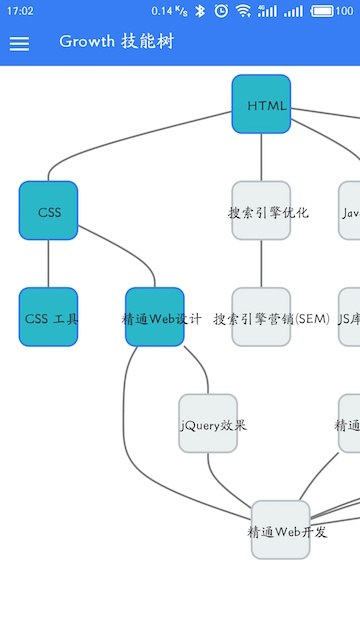

# MoTree: A Mobile Skilltree

Current Support: Android, iOS, Google PWA

Inspired By & Data based on [https://github.com/352Media/skilltree](https://github.com/352Media/skilltree)

SVG based on [Sherlock](https://github.com/phodal/sherlock)

截图

Stack
---

 - Ionic 1.x
 - Angular 1.x

License
---

© 2016 A [Phodal Huang](https://www.phodal.com)'s [Idea](http://github.com/phodal/ideas).  This code is distributed under the MIT license. See `LICENSE` in this directory.

[待我代码编成，娶你为妻可好](http://www.xuntayizhan.com/blog/ji-ke-ai-qing-zhi-er-shi-dai-wo-dai-ma-bian-cheng-qu-ni-wei-qi-ke-hao-wan/)
